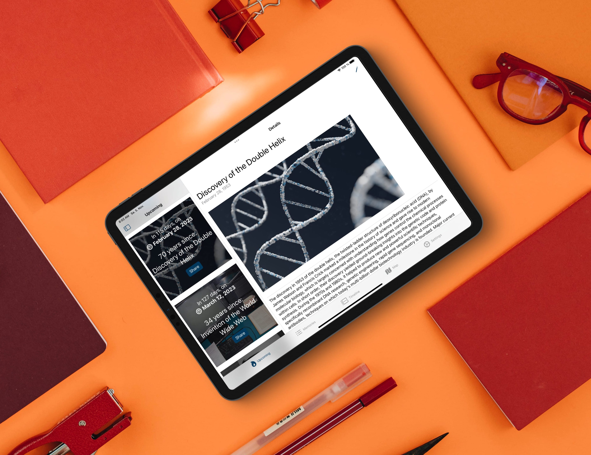

# Remember: An iOS-App to celebrate your memories 🎉

## Remember is a native Swift UI Cathalist-App

Remember is a place where you can store your important memories. It notifies you before important anniversaries so you
never miss an opportunity to celebrate.

## Use Remember to store historic moments or personal memories

## See which anniversaries are upcoming and share it with your friends

## See where the memories happened

## Use Remember on your Mac, iPad or iPhone

